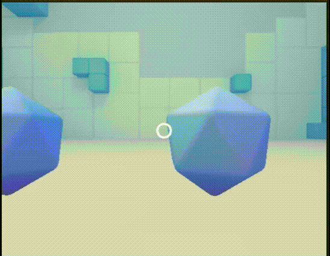

# Practica-5-II

Autor: Eric Bermúdez Hernández

Email: alu0101517476@ull.edu.es

----

**Descripción del trabajo realizado**

Partiendo de la escena base proporcionada por el tutorial oficial de Google Cardboard para Unity, se llevó a cabo un proceso de personalización para cumplir con los requisitos del ejercicio, cuyo objetivo principal era crear una experiencia interactiva en realidad virtual para Android, donde el usuario pudiera recolectar objetos mediante la mirada y posteriormente atraerlos hacia sí mismo.

En primer lugar, se duplicó la escena original del tutorial para trabajar sobre una copia y preservar la escena base. Se mantuvo el sistema de retícula reactiva proporcionado por Google Cardboard, que permite detectar cuándo el jugador apunta con la mirada a un objeto.

A continuación, se incorporó un sistema propio de interacción mediante “selección por permanencia de mirada” (gaze dwell). Para ello, se añadieron los scripts `GazeInteractor`, `ILookSelectable`, `Collectible`, `Inventory` y `Magnet`. Estos scripts permiten capturar cuándo el jugador fija la mirada sobre un objeto durante un tiempo determinado, registrar ese objeto como recolectado y, posteriormente, enviarlo hacia el jugador cuando se selecciona un objeto especial denominado “magnet”.

Los objetos recolectables se obtuvieron reutilizando los tesoros originales del tutorial de Google. A estos elementos se les asignó una capa específica llamada`Interactable`, se les añadió un collider correctamente dimensionado para ser detectados por la retícula, y se les incorporó el script `Collectible`, lo que les permite reaccionar a la mirada del usuario y ser almacenados en un inventario virtual.

Por último, se añadió un objeto “recuperador” o imán en la escena, configurado con el script Magnet. Al mirar este objeto, se activa un evento global que hace que todos los recolectables previamente recogidos se desplacen automáticamente hacia la cámara del jugador, simulando el efecto de atracción.

Con estos pasos, la escena original de Google Cardboard fue modificada y ampliada hasta convertirse en un entorno interactivo con terreno, objetos recolectables y mecánicas completas de mirada, movimiento y atracción, cumpliendo los objetivos requeridos para la práctica y preparado para ser exportado como APK para dispositivos Android mediante Google Cardboard.

Los códigos de los Scripts mencionados anteriormente son los siguientes:

1. `GazeInteractor.cs`

```C#
using UnityEngine;
using UnityEngine.UI;

public class GazeInteractor : MonoBehaviour
{
    public float maxDistance = 20f;
    public LayerMask interactableMask;

    public float dwellTime = 1.2f; 

    private float timer = 0f;
    private ILookSelectable current;
    private Transform cam;

    void Awake()
    {
        cam = Camera.main.transform;
        if (reticleFill) reticleFill.fillAmount = 0f;
    }

    void Update()
    {
        Ray ray = new Ray(cam.position, cam.forward);
        if (Physics.Raycast(ray, out RaycastHit hit, maxDistance, interactableMask.value == 0 ? ~0 : interactableMask))
        {
            var selectable = hit.collider.GetComponentInParent<ILookSelectable>();
            if (selectable != null)
            {
                if (current != selectable)
                {
                    current?.OnLookExit();
                    current = selectable;
                    current.OnLookEnter();
                    timer = 0f;
                    if (reticleFill) reticleFill.fillAmount = 0f;
                }
                else
                {
                    timer += Time.deltaTime;
                    if (reticleFill) reticleFill.fillAmount = Mathf.Clamp01(timer / dwellTime);
                    if (timer >= dwellTime)
                    {
                        current.OnLookSelect();
                        timer = 0f;
                        if (reticleFill) reticleFill.fillAmount = 0f;
                    }
                }
            }
            else
            {
                ClearCurrent();
            }
        }
        else
        {
            ClearCurrent();
        }
    }

    void ClearCurrent()
    {
        if (current != null)
        {
            current.OnLookExit();
            current = null;
        }
        timer = 0f;
        if (reticleFill) reticleFill.fillAmount = 0f;
    }
}

```

2. `Collectible.cs`

```C#
using UnityEngine;

[RequireComponent(typeof(Collider))]
public class Collectible : MonoBehaviour, ILookSelectable
{
    public float pickupDistance = 4f;
    public float attractSpeed = 6f;

    bool collected = false;
    bool attracting = false;
    Transform attractTarget;
    Transform cam;

    void OnEnable()  { Inventory.OnSummon += HandleSummon; }
    void OnDisable() { Inventory.OnSummon -= HandleSummon; }

    void Start() { cam = Camera.main.transform; }

    public void OnLookEnter() { }
    public void OnLookExit()  { }

    public void OnLookSelect()
    {
        if (collected) return;
        if (Vector3.Distance(transform.position, cam.position) <= pickupDistance)
            Collect();
    }

    void Collect()
    {
        collected = true;
        Inventory.Instance.Add(this);
        var col = GetComponent<Collider>(); if (col) col.enabled = false;
        transform.localScale *= 0.9f; 
    }

    void HandleSummon(Transform target)
    {
        if (!collected) return;
        attractTarget = target;
        attracting = true;
    }

    void Update()
    {
        if (attracting && attractTarget != null)
        {
            transform.position = Vector3.MoveTowards(
                transform.position, attractTarget.position, attractSpeed * Time.deltaTime);
        }
    }
}

```

3. `ILookSelectable.cs`

```C#
public interface ILookSelectable
{
    void OnLookEnter();
    void OnLookExit();
    void OnLookSelect();  // Se llama al completar la "mirada" (dwell)
}

```

4. `Inventory.cs`

```C#
using System.Collections.Generic;
using UnityEngine;

public class Inventory : MonoBehaviour
{
    public static Inventory Instance { get; private set; }
    public Transform player;

    private readonly List<Collectible> collected = new();

    public delegate void SummonOrder(Transform target);
    public static event SummonOrder OnSummon;

    void Awake()
    {
        if (Instance != null && Instance != this) { Destroy(gameObject); return; }
        Instance = this;
    }

    public void Add(Collectible c)
    {
        if (!collected.Contains(c)) collected.Add(c);
    }

    public void SummonToPlayer()
    {
        if (player != null) OnSummon?.Invoke(player);
    }
}

```

5. `Magnet.cs`

```C#
using UnityEngine;

public class Magnet : MonoBehaviour, ILookSelectable
{
    public void OnLookEnter() { }
    public void OnLookExit()  { }

    public void OnLookSelect()
    {
        Inventory.Instance.SummonToPlayer();
    }
}

```

En el siguiente vídeo se puede ver el funcionamiento de la escena, probado desde el ordenador:



